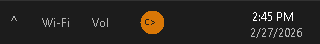
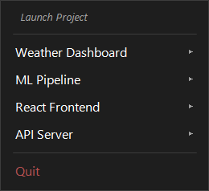

# ClaudeDock

<p align="center">
  
</p>

<p align="center"><strong>Get back to your projects faster.</strong></p>

A lightweight Windows system tray app for managing and launching [Claude Code](https://docs.anthropic.com/en/docs/claude-code) projects with one click.

Click the tray icon to see your projects. Select one to open **File Explorer**, **VS Code**, and a **terminal with Claude Code** all at once. Resume previous conversations or start fresh.

## Screenshots

<p align="center">
  
  <br>
  <em>ClaudeDock lives in your system tray</em>
</p>

<p align="center">
  
  &nbsp;&nbsp;
  
  <br>
  <em>Git status at a glance, session history per project</em>
</p>

## Features

- System tray icon, always one click away
- One-click launch: Explorer + VS Code + Claude Code terminal
- Git status per project (branch, uncommitted changes, unpushed commits)
- Session resume: continue your last conversation or pick from recent sessions
- Simple JSON configuration
- Toggle which apps to launch (Explorer, VS Code, Claude)
- No dependencies beyond PowerShell (ships with Windows)
- Auto-start on login with included install script
- Pin to taskbar for quick access

## Quick Start

1. Clone the repo:
   ```
   git clone https://github.com/RyanSeanPhillips/ClaudeDock.git
   ```

2. Copy the example config and add your projects:
   ```
   cp config.example.json config.json
   ```

3. Edit `config.json` with your project paths:
   ```json
   {
       "projects": [
           {
               "name": "My Project",
               "path": "C:\\Users\\you\\projects\\my-project"
           }
       ],
       "launch": {
           "explorer": true,
           "vscode": true,
           "claude": true
       },
       "icon_color": "#DA8F4E"
   }
   ```

4. Run `ClaudeDock.ps1` or double-click `install.bat` to add it to Windows startup.

## Usage

Left-click or right-click the tray icon to see your projects. Click a project to open:

- **File Explorer** at the project directory
- **VS Code** with the project folder
- **A terminal** with Claude Code already running

## Pin to Taskbar

Run `create-shortcut.ps1` to generate a desktop shortcut, then right-click it and select **Pin to taskbar**.

## Configuration

| Field | Description |
|---|---|
| `projects[].name` | Display name in the menu |
| `projects[].path` | Absolute path to the project directory |
| `launch.explorer` | Open File Explorer at project path |
| `launch.vscode` | Open VS Code at project path |
| `launch.claude` | Open a terminal and start Claude Code |
| `icon_color` | Hex color for the tray icon (default: `#DA8F4E`) |

## Install / Uninstall

- **`install.bat`** — Adds ClaudeDock to Windows startup so it runs on login.
- **`uninstall.bat`** — Removes it from startup.

## Requirements

- Windows 10/11
- PowerShell 5.1+ (included with Windows)
- [Claude Code](https://docs.anthropic.com/en/docs/claude-code) installed and available in your PATH
- VS Code (optional, disable with `"vscode": false` in config)

## Roadmap

- [x] Session resume (pick from recent conversations per project)
- [x] Git status indicators per project
- [ ] Usage monitoring (tokens per project, parsed from local session files)
- [ ] Session history and stats

## License

MIT
